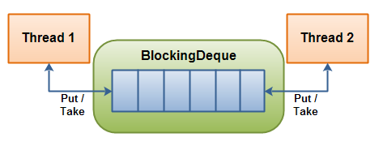

# Job Management

 A simple Job Management Service prototype

### Prerequisites
```
JDK 8
Gradle
```

## How it works:

There are three main actors in the application which are `JobProducer`, `JobConsumer` and `JobExecuter`.

* JobProducer is producing jobs and adding them to the queue based on priority.
If the job has high priority, it will add it to the head of the queue, otherwise it will add to the end of the queue.
* JobConsumer retrieves and removes the head of the queue (in other words, the first element of this deque), waiting if necessary until an element becomes available.
Then it schedules the taken job and pass it to the JobExecutor.
* JobExecutor executes the job based on its type.



As shown on the above illustration, JobProducer is represented by Thread 1 which will produce jobs and insert them into either the head or the end of the queue.
JobConsumer is represented by Thread 2 which will take a job and then will remove it from the head of the queue.